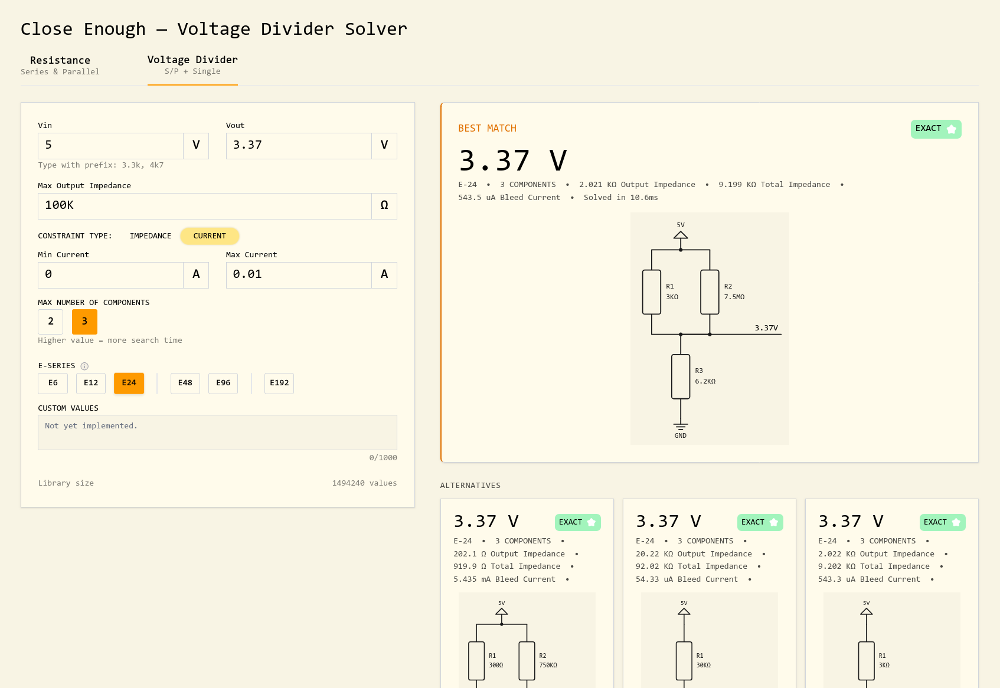

<h1 align="center">
    Close Enough
    <br />
    <br />
    
    <br />
</h1>

<h4 align="center">
    3-component resistor combination solver
</h4>

<div align="center">


</div>

<p align="center">
  <a href="https://close-enough.incendium.me"><strong>Try it live →</strong></a>
</p>


<p align="center">
  <a href="#features">Features</a> •
  <a href="#how-it-works">How it Works</a> •
  <a href="#development">Development</a> •
  <a href="#license">License</a>
</p>

## Features

- Solve resistor combinations for resistance or voltage divider circuits
- Fast solve times - less than 20 milliseconds for all configurations on a typical laptop
- Up to 3 resistors per combination
- Constrain results by an output or total impedance range
- Select which E-Series subsets to solve with

## Motivation

Picking resistors for voltage dividers is annoying. You have to juggle multiple values and constraints at once, and working with a coarse set of values that manufacturers actually produce does not make that process any easier. You could hand the task off to an LLM, but that is slow and prone to errors.

## How it Works

### Caching

On first load, the site generates E-Series values over a decade range of -1 to 6, which covers 100mΩ all the way to ~9.88MΩ. It then iterates over those values, calculating series and parallel combinations for each resistor pair. Afterwards, a radix sort generates sorted indices which are then cached together with the rest of the values in an OPFS file.

Generating the cache is inherently slow, as it's an O(N²) step, but it is what makes the actual solver incredibly fast. Instead of iterating over every possible combination, which would take O(N²) or O(N³) time, a cache simplifies query time to O(logN) and O(N logN) respectively.

### Algorithm

The solver never enumerates every single resistor network. Instead it exploits the fact that any series/parallel combination has a single degree of freedom: once you fix all but one component, the value the remaining piece *would need* to hit the target is a closed-form expression. So rather than searching combinations, the solver computes that ideal value and binary-searches the cache for the closest real one.

For a **two-resistor** network, the algorithm is simple: binary search the cache then scan a few neighbors to collect the best matches. For a **3-resistor** network, the solver iterates over all resistor values, pinning each resistor as `r1`, then binary searches the cache for the optimal `r2` and `r3` pair. This approach reduces the problem to O(N logN), compared to an O(N³) brute-force solution.

The algorithm works similarly for voltage dividers. Iterate over all resistor values, fix `r1`, calculate the optimal resistance for the other arm, then binary search the cache for the closest match.

## Development

Install [Bun](https://bun.sh) then run:

```bash
# clone the repo
git clone https://github.com/incend1um3/Close-Enough
cd Close-Enough

# install dependencies
bun i

# start the dev server
bun dev
```

## License

See [LICENSE](LICENSE)
